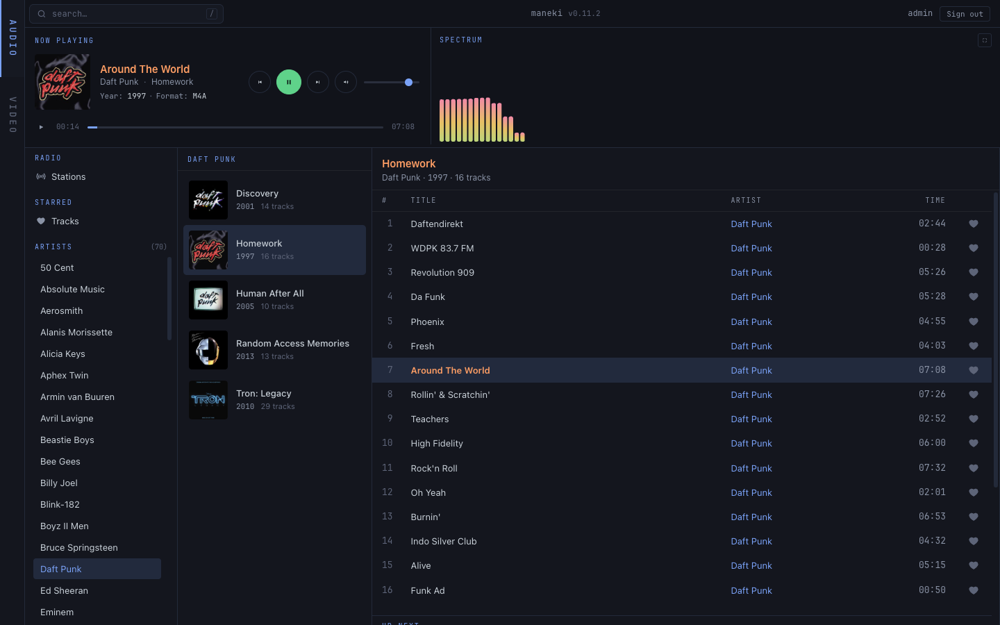
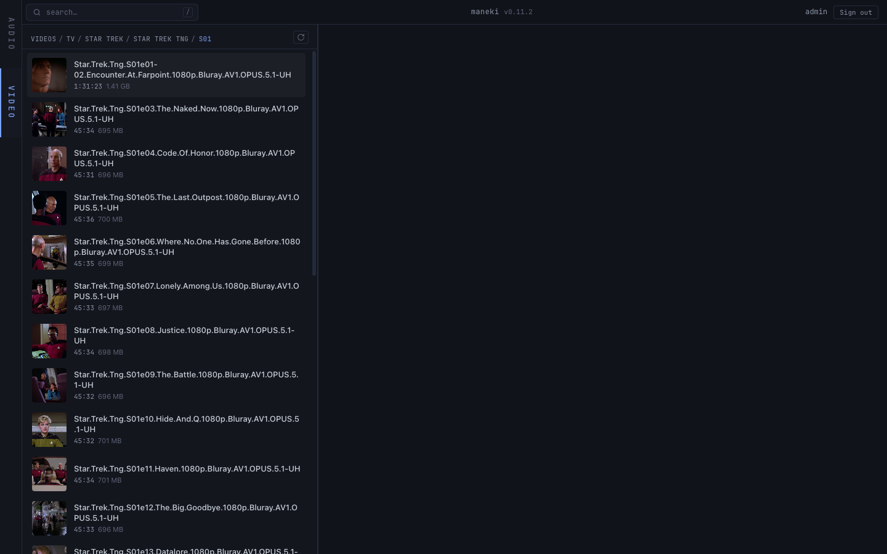
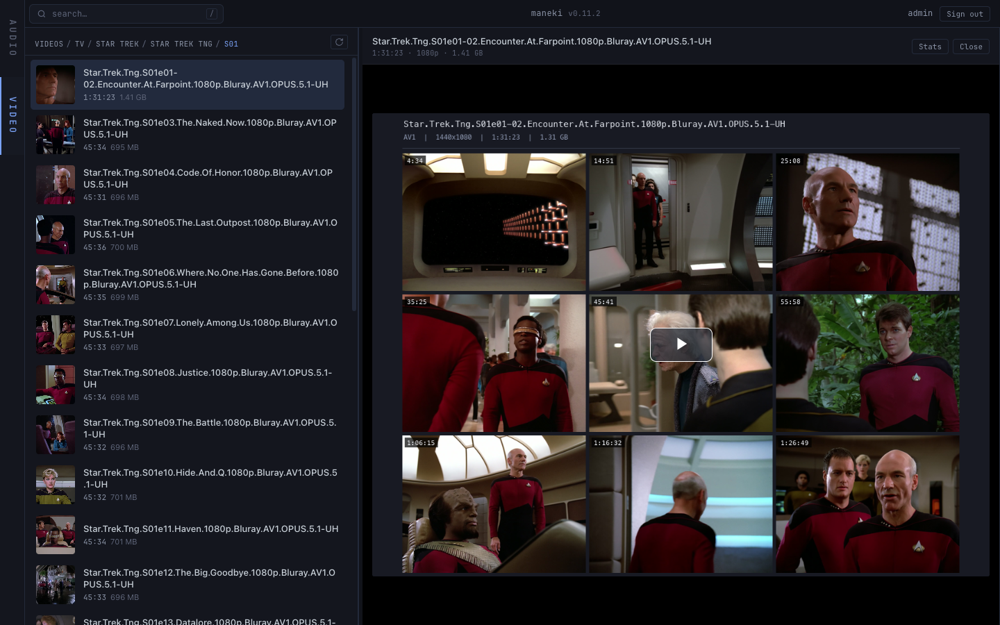

# Maneki

[](https://github.com/winterop-com/maneki/actions/workflows/ci.yml)
[](https://pypi.org/project/maneki/)
[](https://www.python.org/downloads/)
[](LICENSE)
[](https://winterop-com.github.io/maneki/)

A self-hosted media library for your own audio and video. Point `maneki serve` at one directory and it scans recursively, auto-detects what's audio and what's video, and serves both kinds plus the web SPA on a single port. Audio is served over a Subsonic-compatible API (convert rips, then stream to any Subsonic client); video streams over HLS with on-demand segments, sidecar + embedded subtitles, contact-sheet posters, and a click-in folder browser. The Subsonic mount appears only when audio is present, the video mount only when video is present.

## The name

**Maneki** (招き, *mah-neh-kee*) is the Japanese word for *beckoning*. It's the verb-form of *maneki-neko* (招き猫) — the small ceramic cat with a raised paw you've seen on shop counters and restaurant windows across Japan. The cat sits there quietly all day; when you walk in, its paw is already up, inviting you in. Whoever placed it didn't have to do anything; the cat does the welcoming.

A self-hosted media server has the same job. It lives on a box in the corner. You don't see it, you don't manage it, you don't poke at it. When you open the app on your phone or laptop and want to watch a film or play music, your library should already be there, ready, waving you in. No URL to type, no port to remember, no "is the server up?" — just open and play.

That's what `maneki serve <library>` aims to be: the cat on the shelf.

## Install

The lowest-friction way is [`uvx`](https://docs.astral.sh/uv/) — it downloads, caches, and runs the latest published `maneki` in one step. No install step required:

```bash
uvx maneki --help
```

For daily / persistent use (PATH-installed, no per-run network check):

```bash
uv tool install maneki
maneki --help
```

You'll also need `ffmpeg` and `ffprobe` on `$PATH` for the convert pipeline:

```bash
brew install ffmpeg            # macOS
sudo apt install ffmpeg        # Debian / Ubuntu
```

### Desktop apps

Beyond the CLI and the browser SPA, Maneki has native desktop clients — a **Tauri** (~15 MB, native WebKit) and an **Electron** (~120 MB, bundled Chromium) wrapper around the same Subsonic web UI. Prebuilt installers for macOS, Linux, and Windows are attached to every [release](https://github.com/winterop-com/maneki/releases/latest) — the macOS Tauri `.dmg` is signed + notarized (opens with no Gatekeeper warning); the Linux/Windows and Electron builds are unsigned. Or build from source:

```bash
git clone https://github.com/winterop-com/maneki.git && cd maneki
make desktop-tauri-build      # -> .app + .dmg
make desktop-electron-build   # -> .dmg
```

See the [desktop guide](docs/guides/desktop.md) for the full walkthrough.

## Quickstart

```bash
# One process, one URL, both protocols. Point at any directory - maneki
# scans recursively and only mounts the kinds with content.
uvx maneki serve ~/Downloads/library                     # audio on /audio/rest/*, video on /video/*
uvx maneki serve ~/Downloads/library --ui                # also serve the web SPA at /

# Shared across audio + video:
uvx maneki library info    ~/Downloads/library           # kind counts (audio + video)
uvx maneki library list    ~/Downloads/library           # full file inventory (or `ls`)
uvx maneki library inspect ~/Downloads/library/some.mkv  # tags + cover (audio) or ffprobe streams (video)

# Audio tooling:
uvx maneki audio convert ./input ./output                          # convert rips
uvx maneki audio library audit ./output                            # audit
uvx maneki audio playlist gen ./output --seed <track> --minutes 60 # auto-generate a mix
```

## Screenshots

The browser SPA — bordered panels with floating titles, same palette across audio + video. Vertical AUDIO / VIDEO rail on the left switches modes; the rail self-hides when only one kind is mounted at the library root.

Audio — Artists → Albums → Tracks plus Now Playing top band with the FFT spectrum visualizer:



Video — folder browser, instant-paint row thumbnails, sticky breadcrumb. Click into any season for the episode list:



Video player — video.js v8 on the HLS source, contact-sheet poster (16:9, generated server-side from 9 sample frames + header strip with codec / resolution / duration / size), `t` for theater mode, `f` for browser fullscreen, captions menu auto-prefers English / English-SDH:



More in the [serve guide](https://winterop-com.github.io/maneki/guides/serve-unified/) and the [video guide](https://winterop-com.github.io/maneki/guides/video/).

## Documentation

Full docs are at **[docs/](docs/index.md)** — built with MkDocs Material. Run them locally:

```bash
make docs-serve     # http://127.0.0.1:8000
```

Or jump straight to:

- [Architecture](docs/architecture.md) — how all the pieces fit together (process model, data flow, audio subprocess, SQLite index, FFT visualizer)
- [Quickstart](docs/guides/quickstart.md) — end-to-end walkthrough including iPhone + Tailscale + Amperfy
- [maneki serve](docs/guides/serve-unified.md) — single-library mode, auto-detect, web SPA
- [maneki library](docs/guides/library.md) — cross-cutting info / list / inspect against any root
- [maneki audio convert](docs/guides/convert.md) — codec / bitrate / enrichment matrix
- [maneki audio library](docs/guides/audio-library.md) — audit rules + auto-fix + SQLite index
- [maneki video](docs/guides/video.md) — HLS, subtitles, posters, folder browser
- [maneki audio playlist](docs/guides/playlist.md) — auto-generated `.m3u8` mixes anchored to a seed track
- [Desktop apps](docs/guides/desktop.md) — Tauri + Electron generic Subsonic clients
- [Mobile (Subsonic)](docs/guides/mobile.md) — play:Sub / Amperfy / Symfonium / DSub / Tempo
- [Edge cases](docs/edge-cases.md) — every weirdness encountered on real rips
- [Roadmap](docs/roadmap.md) — what's next
- [Development](docs/guides/development.md) — directory layout + test patterns + commit style

## Status

v0.11.2 · audio (Subsonic-compat) + video (HLS, sidecar + embedded subtitles, 16:9 contact-sheet posters, folder browser, watcher hot-reload) share one `maneki serve` and the web SPA at `/`. Signed + notarized macOS desktop builds (plus unsigned Linux / Windows / Electron) ship on every release. ruff + mypy + pyright clean, full pytest suite green (667 tests).

**Audio**: OpenSubsonic-compatible (`multipleGenres`, `transcodeOffset`, `songLyrics` extensions), backs heart / star buttons with a persistent `<root>/.maneki/stars.toml`, returns sub-ms FTS5-ranked `/search3` results, promotes LRC lyrics to `synced: true`, tested against Symfonium / Amperfy / play:Sub / Feishin on iOS / Android / desktop. Persistent SQLite library index at `<root>/.maneki/index.db` keeps cold starts under a second; the filesystem watcher does per-album incremental rescans.

**Video**: on-demand HLS with bounded foreground concurrency (rapid seeks don't wedge the player), single-ffmpeg multi-stream subtitle extraction (a 45-track .mkv opens in ~2s instead of stalling on 45 parallel ffmpegs), instant-paint row thumbnails + 16:9 contact-sheet posters with hash-derived cache filenames (deeply-nested rel paths don't blow NAME_MAX), `--no-cover-images` to skip contact sheets entirely on slow disks, `--prewarm-cache` to fill thumbs / posters / subtitles at startup, watcher hot-reload of the SQLite-backed scan index so adds / deletes / renames appear without a restart. Same `index.db` file as the audio side, separate `videos` table.

## License

See LICENSE in the repo root.
