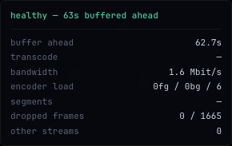

# Maneki

A self-hosted media library for your own audio and video. Convert arbitrary audio rips (FLAC / MP3 / M4A / WAV / OGG / OPUS) into a clean tagged library and serve it over LAN / Tailscale via a Subsonic-compatible HTTP server; stream video over HLS with on-demand segments, sidecar + embedded subtitles, contact-sheet posters, and a folder browser — all behind one `maneki serve` and one web SPA.

## The name

**Maneki** (招き, *mah-neh-kee*) is the Japanese word for *beckoning*. It's the verb-form of *maneki-neko* (招き猫) — the small ceramic cat with a raised paw you've seen on shop counters and restaurant windows across Japan. The cat sits there quietly all day; when you walk in, its paw is already up, inviting you in. Whoever placed it didn't have to do anything; the cat does the welcoming.

A self-hosted media server has the same job. It lives on a box in the corner. You don't see it, you don't manage it, you don't poke at it. When you open the app on your phone or laptop and want to watch a film or play music, your library should already be there, ready, waving you in. No URL to type, no port to remember, no "is the server up?" — just open and play.

That's what `maneki serve <library>` aims to be: the cat on the shelf.

## Screenshots

The browser SPA — bordered panels with floating titles, one palette across audio and video. A vertical AUDIO / VIDEO rail on the left switches modes, and self-hides when only one kind is mounted at the library root.

Audio — Artists → Albums → Tracks, with a Now Playing band and the FFT spectrum visualizer:


Video — folder browser with instant-paint row thumbnails and a sticky breadcrumb; click into any season for the episode list:


Video player — video.js on the HLS source with a server-generated 16:9 contact-sheet poster (`t` for theater mode, `f` for fullscreen, captions auto-prefer English):


Live diagnostics — a draggable overlay (fed by Server-Sent Events) that classifies playback as healthy, encoder-bound, or network-bound, with buffer-ahead, transcode realtime ratio, bandwidth, and dropped-frame counts:



## What it does

```
input/                            output/
└── messy rips/                   └── Artist/
    [FLAC] Some Album (CD1)/          └── 2012 - Album Name/
       01-track.flac      ─►              ├── 01 - First Track.m4a
       ...                                ├── 02 - Second Track.m4a
                                          └── cover.jpg
```

End-to-end pipeline:

1. **Walk** the input tree, group by leaf directory, merge multi-disc layouts.
2. **Read** source tags (mutagen for FLAC / MP3 / MP4) plus filename fallback for tagless rips.
3. **Re-encode** via `ffmpeg`, default to 256k AAC m4a (Apple Music quality, ~24% the size of lossless).
4. **Pick a cover** — embedded, sidecar, or online via MusicBrainz + Cover Art Archive.
5. **Write clean tags** + the normalised cover; lay out as `output/<Artist>/<YYYY> - <Album>/NN - <Title>.m4a`.

Then on top of that:

- **`maneki audio library`** — read, audit, fix, retag, cover, and manage the converted audio library. Subcommands:
  - `audio library tree DIR` / `audit DIR` / `fix DIR` — render, audit, auto-fix
  - `audio library cover IMAGE DIR` / `cover-pick DIR` / `retag DIR` — in-place tag and cover edits; semi-automated cover selection via [musichoarders.xyz](https://covers.musichoarders.xyz/)
  - `audio library lyrics fetch DIR` — populate `<track>.lrc` sidecars from [LRCLIB](https://lrclib.net) (free, no API key, returns synced lyrics for popular tracks)
  - `audio library index status|drop|rebuild DIR` — manage the persistent SQLite index at `<DIR>/.maneki/index.db`
- **`maneki serve`** — one server, one library root. Scans the directory recursively and auto-mounts whichever kinds have content: the Subsonic API at `/audio/rest/*` when audio is present, the Maneki-native video API at `/video/api/*` when video is present, the web SPA at `/` with `--ui`. Any Subsonic client (Symfonium, Amperfy, play:Sub, Feishin) reads `/audio/rest/*` directly. Real heart / star button (persistent favourites at `<root>/.maneki/stars.toml`); LRC bodies promoted to `synced: true` so client lyrics views highlight live. Video pipeline includes HLS streaming with on-demand MPEG-TS segments, sidecar `.srt` + embedded subtitle extraction to WebVTT, contact-sheet posters, click-in folder browser. See [Serve](guides/serve-unified.md) and [Video](guides/video.md).
- **`maneki info` / `list` / `inspect`** — cross-cutting top-level commands for any library root. `info` counts files per kind, `list` walks the tree, `inspect` dumps tags / cover for an audio file or ffprobe streams / container info for a video file.
- **`maneki doctor`** — check the media-tooling environment: ffmpeg/ffprobe, which H.264 encoder serving will use (VAAPI / VideoToolbox / libx264), and whether HDR tonemapping (zscale) is available — with fix hints.
- **`maneki audio playlist`** — auto-generate `.m3u8` playlists anchored to a seed track using tag-based similarity (artist / genre / year). `gen` writes a mix; `list` / `show` browse what's saved. Output is plain extended M3U so VLC and Subsonic clients can play it.
- **`maneki audio inspect`** — quick tag dump for a single file (also reachable via the cross-cutting `maneki inspect`).
- **Desktop apps** — Tauri (~15 MB, native WebKit on macOS) and Electron (~120 MB, bundled Chromium) wrappers around a generic Subsonic client UI. URL + Username + Password login; salted-token auth; refresh-restores via URL hash. Prebuilt installers for macOS / Linux / Windows are attached to every [release](https://github.com/winterop-com/maneki/releases/latest) — the macOS Tauri build is signed + notarized; the rest are unsigned. Or build from source with `make build`. See [Desktop apps](guides/desktop.md).
- **Mobile** — no Maneki app of its own; `serve` exposes the standard Subsonic API so play:Sub / Amperfy (iOS) and Symfonium / DSub / Tempo (Android) all work against it. See [Mobile](guides/mobile.md).

## Quickstart

```bash
uvx maneki audio convert ./input ./output
```

`uvx` downloads the latest `maneki` from PyPI, caches it, runs it. For persistent install: `uv tool install maneki`. New here?

- **[Quickstart](guides/quickstart.md)** — full end-to-end walkthrough including iPhone + Tailscale + Amperfy. ~30 minutes.
- **[Architecture](architecture.md)** — how the pieces fit together: process model, data flow, audio engine subprocess, SQLite index, FFT visualizer. Read this first if you want a mental model before diving in.

Per-command guides: [Serve (unified)](guides/serve-unified.md) · [Library](guides/library.md) · [Audio convert](guides/convert.md) · [Audio library](guides/audio-library.md) · [Video](guides/video.md) · [Playlist](guides/playlist.md) · [Inspect](guides/inspect.md).

Clients: [Desktop apps](guides/desktop.md) · [Mobile (Subsonic)](guides/mobile.md).

## Why this exists

Years of rip-collection wrangling produces an audio library full of:

- Scene-tag noise (`[FLAC]`, `[16Bit-44.1kHz]`, `[somesite.com]`)
- Multi-disc layouts in 6 different conventions (`CD1`/`CD2`, `Disc 1`/`Disc 2`, `Album (CD1)`/`Album (CD2)`, …)
- Tagless tracks that need filename parsing to recover artist / title
- Various-Artists rips with `album_artist = "VA"` and the real artist hiding in the filename
- Cover art that's either missing, low-resolution, or back-cover-by-mistake

`maneki audio convert` handles all of these; the rest of the CLI gives you tools to browse, play, audit, and stream the result.

## Status

Top-level commands: `maneki serve` (single-library audio + video + SPA, auto-detects what's there), `maneki ui` (SPA client for any Subsonic server), `maneki doctor` (media-tooling check), `maneki info` / `list` / `inspect` (cross-cutting, any root), `maneki audio <...>` (convert, library, inspect, playlist). Signed + notarized macOS desktop builds (plus unsigned Linux / Windows / Electron) ship on every release. mypy + pyright + ruff clean, 667 tests green. Audio side real-world tested against Symfonium / Amperfy / play:Sub / Feishin clients with persistent favourites and synced lyrics; video side ships HLS with on-demand segments, single-ffmpeg multi-stream subtitle extraction, 16:9 contact-sheet posters, watcher hot-reload, and a SQLite-backed scan index shared with the audio side at `<root>/.maneki/index.db`.

Roadmap items still open are listed at [Roadmap](roadmap.md).
